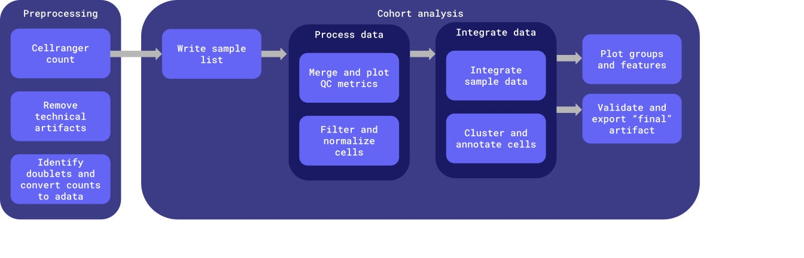

# harmonized-wf-dev

Repo for testing and developing a common postmortem-derived brain sequencing (PMDBS) workflow harmonized across ASAP.

# Table of contents

- [Workflows](#workflows)
- [Inputs](#inputs)
- [Outputs](#outputs)
    - [Output structure](#output-structure)
- [Docker images](#docker-images)


# Workflows

Worfklows are defined in [the `workflows` directory](workflows).

This workflow is set up to implement the [Harmony RNA snakemake workflow](https://github.com/DNAstack/Harmony-RNA-Workflow/tree/main) in WDL. The WDL version of the workflow aims to maintain backwards compatibility with the snakemake scripts. Scripts used by the WDL workflow were modified from the Harmony RNA snakemake repo; originals may be found [here](https://github.com/DNAstack/Harmony-RNA-Workflow/tree/5384b546f02b6e68f154f77d25667fed03759870/scripts), and their modified versions in [the docker/multiome/scripts directory](docker/multiome/scripts).



**Entrypoint**: [workflows/main.wdl](workflows/main.wdl)

**Input template**: [workflows/inputs.json](workflows/inputs.json)

The workflow is broken up into two main chunks:

1. [Preprocessing](#preprocessing)
2. [Cohort analysis](#cohort-analysis)

## Preprocessing

Run once per sample; only rerun when the preprocessing workflow version is updated. Preprocessing outputs are stored in the originating team's raw and staging data buckets.

## Cohort analysis

Run once per team (all samples from a single team) if `project.run_project_cohort_analysis` is set to `true`, and once for the whole cohort (all samples from all teams). This can be rerun using different sample subsets; including additional samples requires this entire analysis to be rerun. Intermediate files from previous runs are not reused and are stored in timestamped directories.

# Inputs

An input template file can be found at [workflows/inputs.json](workflows/inputs.json).

| Type | Name | Description |
| :- | :- | :- |
| String | cohort_id | Name of the cohort; used to name output files during cross-team cohort analysis. |
| Array[[Project](#project)] | projects | The project ID, set of samples and their associated reads and metadata, output bucket locations, and whether or not to run project-level cohort analysis. |
| File | cellranger_reference_data | Cellranger transcriptome reference data; see https://support.10xgenomics.com/single-cell-gene-expression/software/downloads/latest. |
| Float? | soup_rate | Dataset contamination rate fraction; used to remove mRNA contamination from the RNAseq data. [0.2] |
| Boolean? | regenerate_preprocessed_seurat_objects | Regenerate the preprocessed Seurat objects, even if these files already exist. [false] |
| Boolean? | run_cross_team_cohort_analysis | Whether to run downstream harmonization steps on all samples across projects. If set to false, only preprocessing steps (cellranger and generating the initial seurat object(s)) will run for samples. [false] |
| String | cohort_raw_data_bucket | Bucket to upload cross-team cohort intermediate files to. |
| String | cohort_staging_data_bucket | Bucket to upload cross-team cohort analysis outputs to. |
| Int? | clustering_algorithm | Clustering algorithm to use. [3] |
| Float? | clustering_resolution | Clustering resolution to use during clustering. [0.3] |
| File | cell_type_markers_list | RDS file containing a list of major cell type markers; used to annotate clusters. |
| Array[String]? | groups | Groups to produce umap plots for. ['sample', 'batch', 'seurat_clusters'] |
| Array[String]? | features | Features to produce umap plots for. ['doublet_scores', 'nCount_RNA', 'nFeature_RNA', 'percent.mt', 'percent.rb'] |
| String | container_registry | Container registry where workflow Docker images are hosted. |

## Structs

### Project

| Type | Name | Description |
| :- | :- | :- |
| String | project_id | Unique identifier for project; used for naming output files |
| Array[[Sample](#sample)] | samples | The set of samples associated with this project |
| Boolean | run_project_cohort_analysis | Whether or not to run cohort analysis within the project |
| String | raw_data_bucket | Raw data bucket; intermediate output files that are not final workflow outputs are stored here |
| String | staging_data_bucket | Staging data bucket; final project-level outputs are stored here |

### Sample

| Type | Name | Description |
| :- | :- | :- |
| String | sample_id | Unique identifier for the sample within the project |
| String? | batch | The sample's batch. If unset, the analysis will stop after running `cellranger_count`. |
| File | fastq_R1 | Path to the sample's read 1 FASTQ file |
| File | fastq_R2 | Path to the sample's read 2 FASTQ file |
| File? | fastq_I1 | Optional fastq index 1 |
| File? | fastq_I2 | Optional fastq index 2 |

## Generating the inputs JSON

The inputs JSON may be generated manually, however when running a large number of samples, this can become unwieldly. The `generate_inputs` utility script may be used to automatically generate the inputs JSON. The script requires the libraries outlined in [the requirements.txt file](requirements.txt) and the following inputs:

- `project-tsv`: One or more project TSVs with one row per sample and columns project_id, sample_id, batch, fastq_path. All samples from all projects may be included in the same project TSV, or multiple project TSVs may be provided.
    - `project_id`: A unique identifier for the project from which the sample(s) arose
    - `sample_id`: A unique identifier for the sample within the project
    - `batch`: The sample's batch
    - `fastq_path`: The directory in which paired sample FASTQs may be found, including the gs:// bucket name and path
- `fastq-locs-txt`: FASTQ locations for all samples provided in the `project-tsv`, one per line. Each sample is expected to have one set of paired fastqs located at `${fastq_path}/${sample_id}*`. The read 1 file should include 'R1' somewhere in the filename; the read 2 file should inclue 'R2' somewhere in the filename. Generate this file e.g. by running `gsutil ls gs://fastq_bucket/some/path/**.fastq.gz >> fastq_locs.txt`
- `inputs-template`: The inputs template JSON file into which the `projects` information derived from the `project-tsv` will be inserted. Must have a key ending in `*.projects`. Other default values filled out in the inputs template will be written to the output inputs.json file.
- `run-project-cohort-analysis`: Optionally run project-level cohort analysis for provided projects. This value will apply to all projcets. [false]
- `output-file`: Optional output file name. [inputs.json]

Example usage:

```bash
./util/generate_inputs \
    --project-tsv sample_info.tsv \
    --fastq-locs-txt fastq_locs.txt \
    --inputs-template workflows/inputs.json \
    --run-project-cohort-analysis \
    --output-file harmony_workflow_inputs.json
```

# Outputs

## Output structure

- `cohort_id`: either the `project_id` for project-level cohort analysis, or the `cohort_id` for the full cohort
- `workflow_run_timestamp`: format: `%Y-%m-%dT%H-%M-%SZ`
- The list of samples used to generate the cohort analysis will be output alongside other cohort analysis outputs in the staging data bucket (`${cohort_id}.sample_list.tsv`)
- The MANIFEST.tsv file in the staging data bucket describes the workflow name, version, and timestamp for the run used to generate each file in that directory

### Raw data (intermediate files and final outputs for all runs of the workflow)

The raw data bucket will contain all artifacts generated as part of workflow execution. Following successful workflow execution, some artifacts will also be copied into the staging bucket as final outputs.

```bash
asap-raw-data-{cohort,team-xxyy}
└── workflow_execution
    ├── cohort_analysis
    │   └──${cohort_analysis_workflow_version}
    │       └── ${workflow_run_timestamp}
    │            └── <cohort outputs>
    └── preprocess  // only produced in project raw data buckets, not in the full cohort bucket
        ├── cellranger
        │   └── ${cellranger_task_version}
        │       └── <cellranger output>
        └── counts_to_seurat
            └── ${counts_to_seurat_task_version}
                └── <counts_to_seurat output>
```

### Staging data (intermediate workflow objects and final workflow outputs for the latest run of the workflow)

Following QC by researchers, the objects in the staging bucket are synced into the curated data buckets, maintaining the same file structure. Curated data buckets are named `asap-curated-data-{cohort,team-xxyy}`.

```bash
asap-staging-data-{cohort,team-xxyy}
├── cohort_analysis
│   ├── ${cohort_id}.batch_group_umap.png
│   ├── ${cohort_id}.double_scores_feature_umap.png
│   ├── ${cohort_id}.final_metadata.csv
│   ├── ${cohort_id}.major_type_module_umap.png
│   ├── ${cohort_id}.nCount_RNA_feature_umap.png
│   ├── ${cohort_id}.nFeature_RNA_feature_umap.png
│   ├── ${cohort_id}.percent.mt_feature_umap.png
│   ├── ${cohort_id}.percent.rb_feature_umap.png
│   ├── ${cohort_id}.qc.umis_genes_plot.png
│   ├── ${cohort_id}.qc.violin_plots.png
│   ├── ${cohort_id}.sample_group_umap.png
│   ├── ${cohort_id}.sample_list.tsv
│   ├── ${cohort_id}.seurat_clusters_group_umap.png
│   ├── ${cohort_id}.seurat_object.harmony_integrated_neighbors_umap_cluster_07.rds
│   └── MANIFEST.tsv
└── preprocess
    ├── ${cohort_id}.seurat_object.harmony_integrated_04.rds
    ├── ${cohort_id}.seurat_object.harmony_integrated_neighbors_05.rds
    ├── ${cohort_id}.seurat_object.harmony_integrated_neighbors_umap_06.rds
    ├── ${cohort_id}.unfiltered_metadata.csv
    ├── ${sampleA_id}.filtered_feature_bc_matrix.h5
    ├── ${sampleA_id}.metrics_summary.csv
    ├── ${sampleA_id}.molecule_info.h5
    ├── ${sampleA_id}.raw_feature_bc_matrix.h5
    ├── ${sampleA_id}.seurat_object.preprocessed_01.rds
    ├── ${sampleA_id}.seurat_object.preprocessed_filtered_02.rds
    ├── ${sampleA_id}.seurat_object.preprocessed_filtered_normalized_03.rds
    ├── ${sampleB_id}.filtered_feature_bc_matrix.h5
    ├── ${sampleB_id}.metrics_summary.csv
    ├── ${sampleB_id}.molecule_info.h5
    ├── ${sampleB_id}.raw_feature_bc_matrix.h5
    ├── ${sampleB_id}.seurat_object.preprocessed_01.rds
    ├── ${sampleB_id}.seurat_object.preprocessed_filtered_02.rds
    ├── ${sampleB_id}.seurat_object.preprocessed_filtered_normalized_03.rds
    ├── ...
    ├── ${sampleN_id}.filtered_feature_bc_matrix.h5
    ├── ${sampleN_id}.metrics_summary.csv
    ├── ${sampleN_id}.molecule_info.h5
    ├── ${sampleN_id}.raw_feature_bc_matrix.h5
    ├── ${sampleN_id}.seurat_object.preprocessed_01.rds
    ├── ${sampleN_id}.seurat_object.preprocessed_filtered_02.rds
    ├── ${sampleN_id}.seurat_object.preprocessed_filtered_normalized_03.rds
    └── MANIFEST.tsv
```

# Docker images

Docker images are defined in [the `docker` directory](docker). Each image must minimally define a `build.env` file and a `Dockerfile`.

Example directory structure:
```bash
docker
├── multiome
│   ├── build.env
│   └── Dockerfile
└── samtools
    ├── build.env
    └── Dockerfile
```

## The `build.env` file

Each target image is defined using the `build.env` file, which is used to specify the name and version tag for the corresponding Docker image. It must contain at minimum the following variables:

- `IMAGE_NAME`
- `IMAGE_TAG`

All variables defined in the `build.env` file will be made available as build arguments during Docker image build.

The `DOCKERFILE` variable may be used to specify the path to a Dockerfile if that file is not found alongside the `build.env` file, for example when multiple images use the same base Dockerfile definition.

## Building Docker images

Docker images can be build using the [`build_docker_images`](util/build_docker_images) utility script.

```bash
# Build a single image
./util/build_docker_images -d docker/multiome

# Build all images in the `docker` directory
./util/build_docker_images -d docker

# Build and push all images in the docker directory, using the `dnastack` container registry
./util-build_docker_images -d docker -c dnastack -p
```
